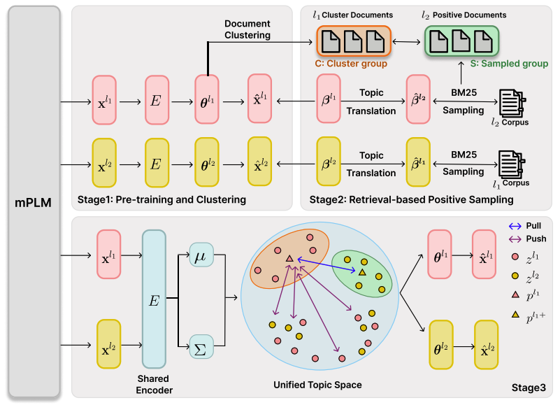

# ProtoXTM: Cross-Lingual Topic Modeling with Document-Level Prototype-based Contrastive Learning (EMNLP 2025 Findings)

ProtoXTM is a novel cross-lingual neural topic modeling framework based on our document-level prototype-based contrastive learning strategy.

📄 Paper Link: https://aclanthology.org/2025.findings-emnlp.1107/


## Framework Overview



ProtoXTM consists of three stages, then utilize the labels of positive sample documents pre-computed in
Stage 1 and Stage 2 to perform cross-lingual topic alignment in Stage 3 through our DPCL strategy.

- Stage1: Pre-train separate VAE-based mono-lingual neural topic models
- Stage2: Retrieval-based Positive Sampling (RPS)
- Stage3: Cross-lingual neural topic model Training with Document-Level Prototype-based Contrastive Learning (DPCL)


## Datasets

The dataset we used can be found at https://github.com/bobxwu/TopMost/tree/main/data


## Acknowledgements

Some parts of the implementation and experiments are based on the code from [TopMost](https://github.com/bobxwu/TopMost).


## Citation

```bibtex
@inproceedings{seo-kwon-2025-protoxtm,
    title = "{P}roto{XTM}: Cross-Lingual Topic Modeling with Document-Level Prototype-based Contrastive Learning",
    author = "Seo, Seung-Won  and
              Kwon, Soon-Sun",
    editor = "Christodoulopoulos, Christos  and
              Chakraborty, Tanmoy  and
              Rose, Carolyn  and
              Peng, Violet",
    booktitle = "Findings of the Association for Computational Linguistics: EMNLP 2025",
    month = nov,
    year = "2025",
    address = "Suzhou, China",
    publisher = "Association for Computational Linguistics",
    url = "https://aclanthology.org/2025.findings-emnlp.1107/",
    doi = "10.18653/v1/2025.findings-emnlp.1107",
    pages = "20340--20354",
    ISBN = "979-8-89176-335-7",
    abstract = "Cross-lingual topic modeling (CLTM) is an essential task in the field of data mining and natural language processing, aiming to extract aligned and semantically coherent topics from bilingual corpora. Recent advances in cross-lingual neural topic models have widely leveraged bilingual dictionaries to achieve word-level topic alignment. However, two critical challenges remain in cross-lingual topic modeling, the topic mismatch issue and the degeneration of intra-lingual topic interpretability. Due to linguistic diversity, some translated word pairs may not represent semantically coherent topics despite being lexical equivalents, and the objective of cross-lingual topic alignment in CLTM can consequently degrade topic interpretability within intra languages. To address these issues, we propose a novel document-level prototype-based contrastive learning paradigm for cross-lingual topic modeling. Additionally, we design a retrieval-based positive sampling strategy for contrastive learning without data augmentation. Furthermore, we introduce ProtoXTM, a cross-lingual neural topic model based on document-level prototype-based contrastive learning. Extensive experiments indicate that our approach achieves state-of-the-art performance on cross-lingual and mono-lingual benchmarks, demonstrating enhanced topic interpretability."
}
```
